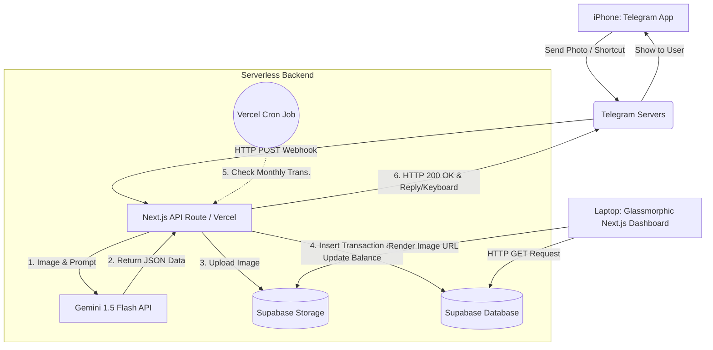

```markdown
# PRD — Project Requirements Document: AI-Powered Telegram & Next.js Finance Tracker (V2.0)

## 1. **Overview**
This application is a serverless personal finance tracking ecosystem designed for personal use. It combines the ease of input via a Telegram Bot with the advanced analytical visualization of a Next.js web dashboard. The system is powered by AI (Vision Language Model) to automatically read and extract data from shopping receipts or transfer screenshots without manual entry, while seamlessly managing multi-wallet balances.

Primary problems solved:
- Manual expense tracking is highly repetitive and time-consuming.
- Physical receipts are often lost or piled up, and m-banking screenshots get mixed up with personal photos in the smartphone gallery.
- Developing and maintaining a native mobile app (iOS) for personal use requires a complex development environment setup (Xcode, developer licenses).
- **[REVISION]** Balance management across various funding sources (Bank, e-Wallet, Cash) is often disconnected from the main expense tracking app.
- **[REVISION]** Fixed recurring transactions (paychecks, rent/internet bills) are frequently forgotten.

Primary platform goals:
- Provide the fastest recording interface via Telegram chat: users simply send a photo of the receipt, and the system handles the rest, including balance adjustments.
- Build a backend engine with zero monthly server costs (*Zero-cost infrastructure*) using Vercel and Supabase.
- Deliver a comprehensive web analytics dashboard, adopting a modern UI structure ("Sparkle" layout), to visually monitor daily and monthly cash flow via a laptop.
- **[REVISION]** Implement a Glassmorphism design style (semi-transparent elements, blur effects, and soft shadows) on the dashboard to prevent a flat visual appearance.
- **[REVISION]** Achieve automatic balance synchronization across multiple wallets based on income and expense inputs.

## 2. **Requirements**
- This project is specifically designed to be *single-tenant* (a single administrative user). No public user registration system is required.
- **Bot-Driven Input & Management:** All data addition operations (*Create*), wallet selection, and shortcut executions are handled via the Telegram Bot. The web dashboard is focused on *Read, Update,* and *Delete* operations (Analytics & Management).
- The system extracts three primary data points from each submitted receipt: **Merchant/Store Name**, **Total Expense (Nominal Amount)**, and **Transaction Date**.
- Physical receipt photos or digital screenshots must be permanently stored in Cloud Storage so they can be reviewed on the web dashboard as proof of transaction.
- The Next.js web dashboard UI/UX follows a 3-column architecture (inspired by the "Sparkle" reference): *Left Sidebar* (Navigation), *Center Column* (Main Charts & History Table), and *Right Column* (Wallet Management, Recent Scans, Account Revenue).
- The dashboard uses the `recharts` library to render an *Area Chart* (expense vs. income trends) and a *Pie/Donut Chart* (category distribution).
- The system must have Webhook protection. Only requests from official Telegram IPs are allowed to trigger the Next.js API.
- **[REVISION] Automated Balance Management:** The system must mathematically deduct or add to the `current_balance` in the wallet table every time a transaction is successfully processed.
- **[REVISION] Recurring Transactions:** Support for mandatory monthly/weekly transactions that run automatically via Cron Jobs without manual intervention.

## 3. **Core Features**

### A. Telegram Bot Interface (Frontend Input)
- **Image Scanner:** Accepts photo submissions (live camera or gallery).
- **Manual Text Input:** Supports manual entry if the user doesn't have a receipt (chat format example: `50000 coffee at starbucks`).
- **Instant Feedback:** The bot provides confirmation replies within seconds.
- **[REVISION] Interactive Wallet Selector:** After the bot successfully extracts a receipt or receives text, it prompts an *Inline Keyboard* with a list of wallets (e.g., "BCA", "Cash", "OVO") so the user can select the source for the deduction/addition.
- **[REVISION] Customizable Shortcuts:** Quick slash commands (e.g., `/paycheck` or `/pay_rent`) are available. With one click/type, the system automatically inputs a pre-configured nominal amount to a specific wallet without typing numbers.

### B. AI & Webhook Engine (Next.js Route Handlers)
- **Telegram Webhook Listener:** The `/api/telegram-webhook` endpoint remains on standby in Vercel to catch incoming message events.
- **OCR & Extraction Logic:** Uses the **Gemini 1.5 Flash API** to analyze images. The prompt is strictly instructed to return a pure JSON object without introductory text.
- **Auto-Categorization:** The AI is trained to guess the expense category based on the merchant name (e.g., "KFC" is automatically categorized as *Food & Beverage*).
- **[REVISION] Vercel Cron Jobs:** An endpoint triggered automatically by a Cron system every midnight to check and execute the list of mandatory monthly expenses or incomes.

### C. Web Analytics Dashboard (Next.js UI - Glassmorphic Design)
All UI components are wrapped with transparent CSS utilities (`backdrop-filter: blur`, `bg-white/60`, *soft borders*).
- **Financial Record Summary:** Glassmorphic metric cards at the top of the dashboard display *Total Balance* (accumulated from all wallets), *Total Spent*, and *Total Saving/Income*.
- **Interactive Multi-Line Area Chart:** A monotone curved chart to track daily expense and income fluctuations simultaneously (*multi-line*).
- **Transaction Table:** Transaction history table with colorful status badges, displaying merchant avatar/initials, date, amount, category, and the wallet used.
- **[REVISION] My Wallet & Cards (Right Column):** Displays virtual card UI for each wallet (resembling ATM cards). Shows the wallet name and actual balance.
  - **Interactive Wallet Cards**: The virtual wallet cards (BCA, Cash, OVO) in the Right Column must function as clickable filters.
  - **Dynamic Dashboard State**: Clicking a specific wallet card dynamically filters the Transaction History Table, the Area Chart, and the Donut Chart to exclusively display the cash flow and history related to that specific wallet.
  - **Aggregate View Reset**: The UI must provide a clear mechanism to toggle back to the "All Wallets" overview (e.g., by clicking the currently active wallet again).
- **[REVISION] Account Revenue / Spending Distribution:** A *Donut Chart* in the bottom right column to view the percentage distribution of expenses/incomes.
- **Recent Scans Viewer:** Displays thumbnails of the latest receipt photos sent via Telegram (can be integrated into the *Card Activities* tab). Clicking a thumbnail opens the photo in full size (*Lightbox*).

## 4. **User Flow**

### Scenario 1: Scanning a Physical Receipt (Outdoors)
1. The user finishes a transaction at a cafe and receives a printed receipt.
2. The user opens the Telegram app on their iPhone and enters the private bot chat.
3. The user takes a picture of the receipt directly from the Telegram camera and sends it.
4. In the backend, Next.js forwards the photo to the Gemini API.
5. Gemini extracts the data: `{"merchant": "Cafein Today", "amount": 65000, "date": "2026-09-01"}`.
6. **[REVISION]** The bot replies with Inline Keyboard options: "Select Wallet: [BCA] [Cash] [OVO]".
7. **[REVISION]** The user clicks [Cash]. Next.js deducts Rp 65,000 from the Cash balance, and saves the image link & JSON to the `transactions` table.
8. The Telegram bot sends a success notification with the updated remaining balance.

### Scenario 2: Dashboard Analysis (On a Laptop)
1. The user opens the dashboard URL (e.g., `https://raka-finance.vercel.app`) in a laptop browser.
2. The dashboard page fetches data from Supabase.
3. The Area Chart immediately reflects a spike on September 1st.
4. **[REVISION]** The user sees the balance on the "Cash" virtual card has decreased, and the dashboard visuals look elegant with the glassmorphism style.
5. The user sees the "Cafein Today" receipt photo appear in the *Recent Scans* panel on the right.
6. **[REVISION]** The user clicks the "Cash" wallet card. The dashboard dynamically updates, filtering the Transaction Table and Charts to exclusively display data related to the "Cash" wallet.
7. **[REVISION]** The user clicks the active "Cash" wallet card again, instantly resetting the view to the "All Wallets" aggregate overview.

### Scenario 3: Shortcut Input (Paycheck / Recurring Expense)
1. **[REVISION]** The user receives their salary with a fixed amount but on an uncertain date.
2. **[REVISION]** The user types `/main_salary` in Telegram.
3. **[REVISION]** The system instantly adds Rp 10,000,000 (based on shortcut configuration) to the [BCA] wallet, updates the database, and the bot replies with an instant balance addition confirmation.

## 5. **Architecture Diagram**


## 6. **Database Schema (Supabase / PostgreSQL)**

| Table Name | Description | Key Columns |
| --- | --- | --- |
| `wallets` **(NEW)** | Stores wallet list & actual balance | `id`, `name` (text), `current_balance` (numeric) |
| `transactions` (Modified) | User's cash flow history | `id`, `wallet_id` (FK), `type` (income/expense), `amount` (numeric), `merchant_name`, `category`, `transaction_date`, `receipt_url`, `created_at` |
| `recurring_schedules` **(NEW)** | Manages automated schedules & amounts | `id`, `wallet_id` (FK), `title`, `amount`, `type`, `frequency` (daily/weekly/monthly), `next_run_date` |

## 7. **Tech Stack & Tooling**

* **Hosting & Backend Logic:** Vercel (Next.js App Router + Route Handlers + Cron Jobs).
* **Database & Object Storage:** Supabase (PostgreSQL).
* **AI & OCR Engine:** Google AI Studio (Gemini 1.5 Flash).
* **Input Gateway:** Telegram Bot API (via standard HTTP Webhook).
* **Frontend Styling:** Tailwind CSS + `shadcn/ui` (Focused on Glassmorphism implementation: `backdrop-blur-md`, `bg-white/40`, `border-white/20`).
* **Charting Library:** `recharts`.
* **Iconography:** Lucide React.

```

```